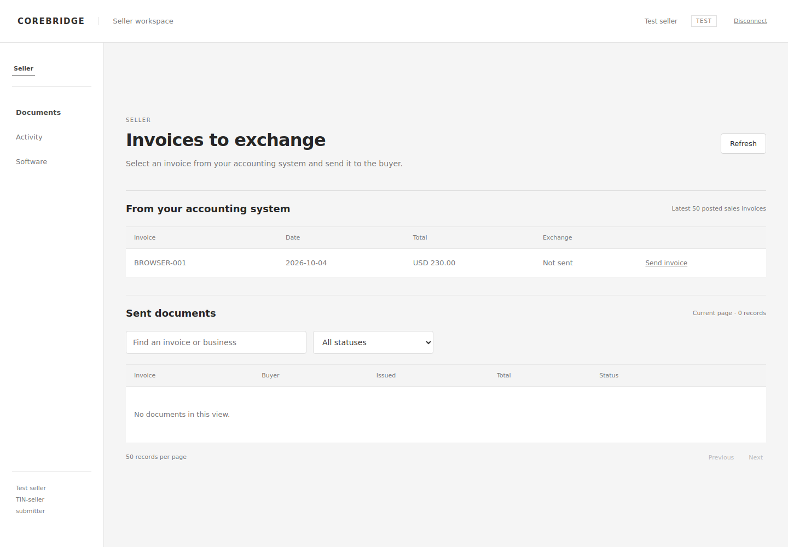
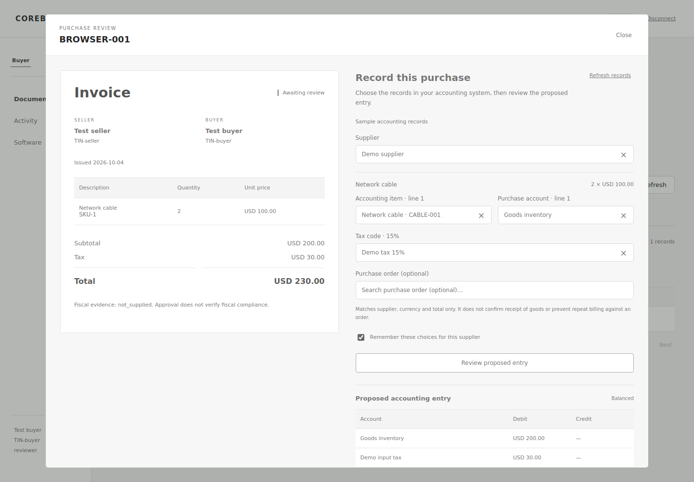
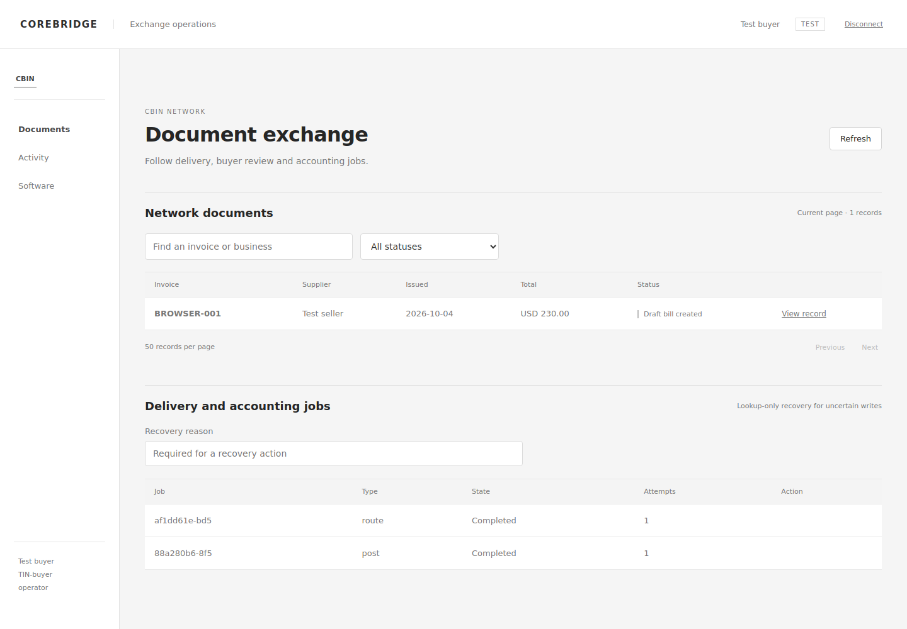

# Demo MVP mechanism and scale review

Reviewed against the executable code on 5 October 2026. Verdict: the modular architecture is suitable for a controlled demo MVP. No tested transactions-per-second or production capacity is claimed. A real vendor-to-vendor pilot and deployment load/restore checks are still needed before calling this a business-ready service.

## Stack and boundaries

| Component | Implementation | Demo/scale assessment |
| --- | --- | --- |
| Seller, buyer, CBIN UI | React 19, TypeScript 5.7, Vite 6 | Separate role-restricted workspaces; plain document tables and invoice/bookkeeping review; builds into FastAPI static assets. Credentials remain in memory. |
| API | Python 3.12+, FastAPI, Pydantic | Synchronous endpoints and SQLAlchemy sessions. Amounts validated with Decimal/integer minor units. Request bodies bounded to 2 MB. ERP calls have timeouts. |
| Database | SQLAlchemy; PostgreSQL 16 deployment; SQLite development | PostgreSQL is the multi-user pilot target. Tenant page indexes added; explicit repeatable `cbin migrate-mvp` upgrade. SQLite tests are not evidence of PostgreSQL capacity. |
| Async processing | Transactional database outbox, separate worker | Submission and jobs commit together. Atomic claims, leases/fencing, backoff, attempt history and reconciliation prevent blind duplicate writes. PostgreSQL uses `SKIP LOCKED`. |
| Identity | Verified business registry, peppered HMAC bearer credentials, roles, test/live boundaries | CLI provisioning is operator-controlled. This verifies supplied evidence in CBIN, not a tax authority assertion. Pilot credentials are separate by role. |
| Connectors | Reviewed JSON mapping profiles; test-only Sandbox, Zoho Books, Odoo 18 adapters | All 34 catalogue IDs exercised through the same protocol. Vendor-native coverage is two test adapters and the Odoo capture addon, not 34 native integrations. |
| Deployment | Multi-stage Node 22/Python 3.12 Docker build; Compose API/worker/migrate/PostgreSQL | Connector configuration and secrets now reach both API and worker. Added private-LAN HTTPS pilot proxy. Native deployment/LAN execution is not verified in this workspace. |
| Verification | pytest, Ruff, TypeScript build, Playwright desktop/mobile; CI PostgreSQL matrix | Provider request/recovery tests use mocked transports. Browser fixtures use a simulated ledger. These cannot certify a vendor API or accounting treatment. |

## The mechanism

1. Seller creates the invoice in its existing business software. Native capture or an authorized export supplies its exact source reference, identities, lines, tax/currency and totals. The seller workspace displays posted source invoices and sends the selected record server-side; the browser cannot overwrite that ERP payload.
2. CBIN validates seller authority and buyer identity, canonical fields, amount arithmetic and source uniqueness. It stores an immutable document and routing job in one database transaction. Repeated submissions use stable keys and source-reference deduplication.
3. Worker delivers the document to the buyer workflow. Buyer workspace reads incoming documents only and polls every 15 seconds while visible. Seller workspace reads outgoing documents. The operator sees network documents, job exceptions and audited recovery actions.
4. Buyer chooses existing supplier, product, line account and tax records from its own accounting connection. Click-to-open lists and **Show more records** allow selection without typing search text. Descriptions, quantities, dates, prices and totals come directly from the invoice. Search is optional.
5. The server checks selected references, complete line coverage, rate/currency and optional PO header match, then computes the proposed allocation. Editing a selection invalidates the UI preview. Approval repeats server validation and saves the decision atomically with a posting job. Previously approved choices are suggested only for the same buyer/seller/environment/connection and valid records.
6. Worker performs reference lookup before any draft-bill write. A confirmed draft receives a provider reference; an uncertain write becomes a reconciliation exception. Odoo recovery verifies draft state, company, supplier, currency, total, line product/account/tax IDs, quantities, prices and zero discounts before accepting it. Operator reconciliation looks up an existing result rather than creating another bill.
7. Seller and buyer receive updated status. A draft bill is not a finalized ledger posting, payment, goods receipt or proof of fiscal compliance. Final accounting controls remain in the business software.

## Issues fixed in this change

- API did not receive ERP configuration/allowlist/secrets shared by the worker, breaking accounting lookup/capture in containers.
- One generic workspace did not reflect seller, buyer and operator responsibilities; now authentication selects the role and document direction.
- Seller capture required external API scripting; Odoo source listing/send and reviewed export upload are now accessible from the seller interface.
- Accounting dropdowns needed a way to expose more than the initial 30 records without typing; now support incremental browsing.
- Epoch-second event timestamps needed conversion before browser rendering.
- Large tenant document lists lacked matching composite environment/business/time indexes; added indexes and a repeatable additive migration.
- Catalogue did not disclose the new Odoo test posting implementation; updated the status while preserving `live_verified=false`.

## Capacity work still required

Keep the modular monolith for this MVP. Deploy stateless API replicas and separate workers against the same PostgreSQL database only after measuring the intended workload. Worker lease duration must exceed the worst supported vendor request/recovery path; inspect queue age, oldest pending job, lease expiry, retry/dead-letter rates, database connections and provider latency. Add request/concurrency limits at the gateway before external access.

The default SQLAlchemy pools are per process; total connections grow with replicas. Budget API/worker pool sizes against the database limit before scaling. The middleware buffers each accepted request, ERP reference snapshots can contain up to 10,000 records, and reference fetching consumes API threads. Offset document pagination and ERP reference lookup remain bounded but need query/latency measurement for large tenants. Introduce cursor paging and server-side reference search when measured data requires them.

Before a business pilot, pin/review Python dependencies and container image digests, scan dependencies, verify backup restores, use managed TLS/secrets, configure health/readiness monitoring and resource limits, test PostgreSQL failover/restarts and concurrent worker claims, and run load tests at the agreed peak volume. CI build/tests provide correctness evidence, not availability or capacity guarantees.

## Functional limits

No native certified connection to all 34 products, OAuth onboarding/refresh automation, ERP-finalized ledger posting, buyer payments, goods receipt/POD, departmental/project allocation, full PO three-way matching or tax authority verification is claimed. Odoo source capture supports a deliberately restricted invoice shape. Zoho/Odoo buyer adapters are test-gated and do not post credits. The catalogue contains POS/e-commerce/database products whose buyer-ledger role must be defined with the actual accounting destination.

Follow [the two-machine pilot](TWO-MACHINE-PILOT.md), [bookkeeping guide](BOOKKEEPING.md), [software matrix](fiscal-harmony-coverage.md) and [operations guide](operations.md). Record real vendor evidence separately from protocol and browser simulations.

## Screens from the implemented application

These screenshots were captured by Playwright using test identities and a simulated ledger. They show the running TypeScript interfaces, not generated mockup images.

